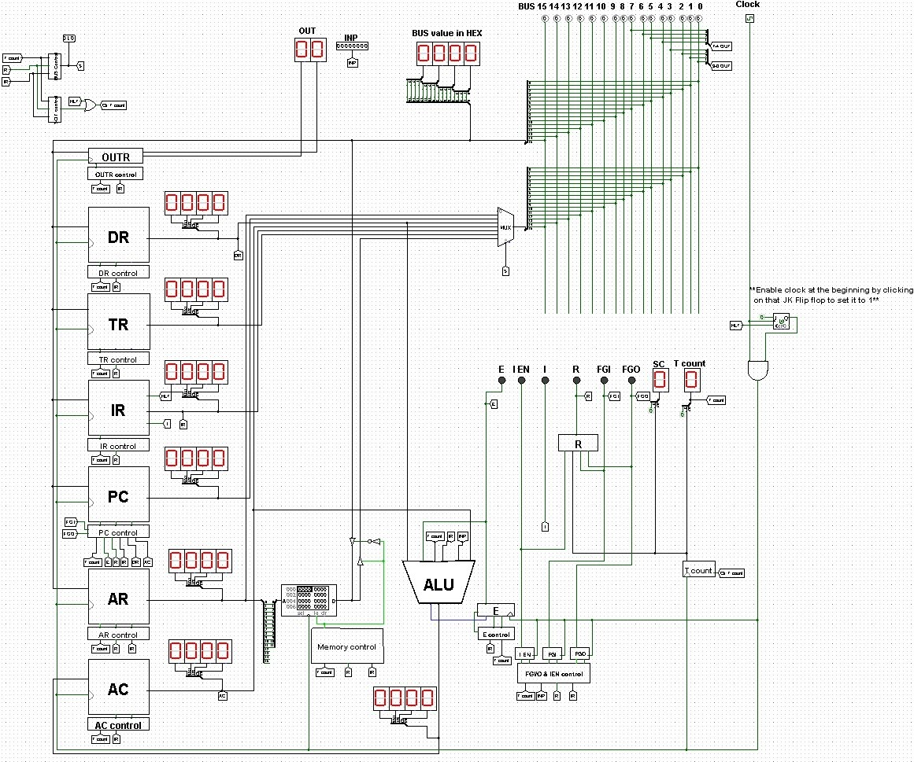
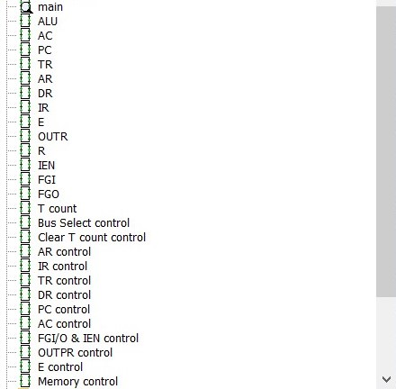

# Mano-Computer-Simulator
This is a fully working implementation of the well known 16-bit Mano Machine in LogiSim. Built using simple memory and registers modules such as AC, AR, PC etc...
Each circuit or module has special layout, which can be viewed and modified. The memory (4096*16 bits) can be programmed hexadecimally, by setting the content of each word to match your assembly code using Mano's instruction to bits guide, which can be tedious sometimes. That's why its adviced to use Naheel Azawy's SCS (Mano Machine Assembly code simulator) https://github.com/Naheel-Azawy/Simple-Computer-Simulator to convert your asssembly code to hexadecimal in a moment and then take the output can be copied then pasted in the first memory location in the Memory Module

***The RTL used was based on "Computer System Architecture" book***
